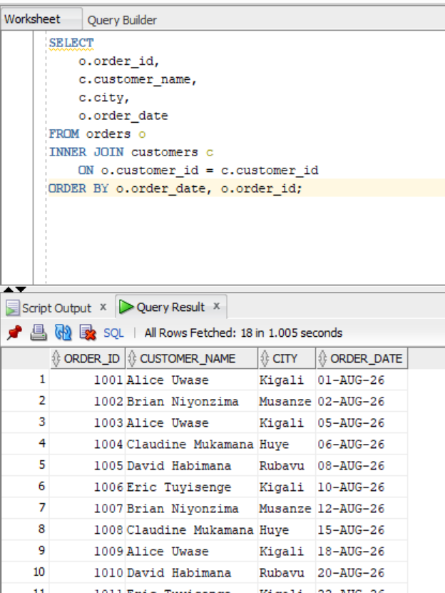
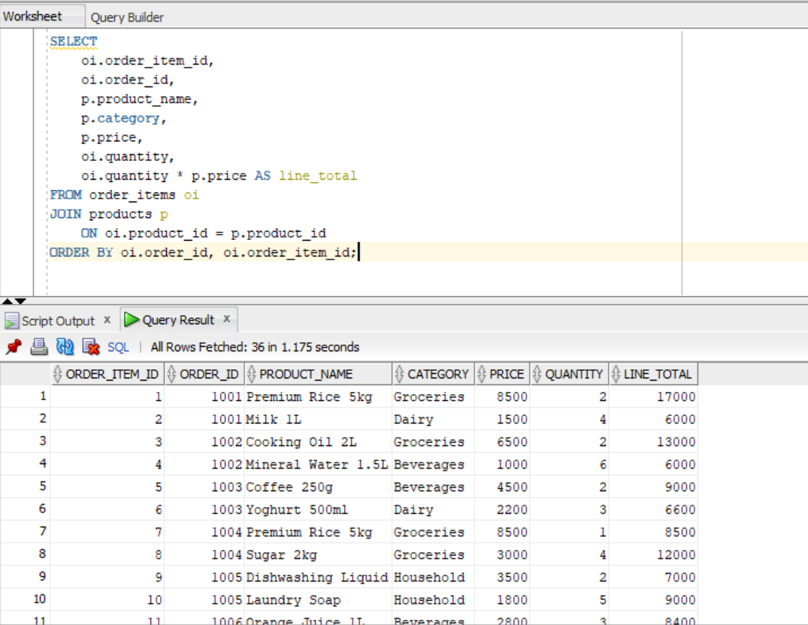
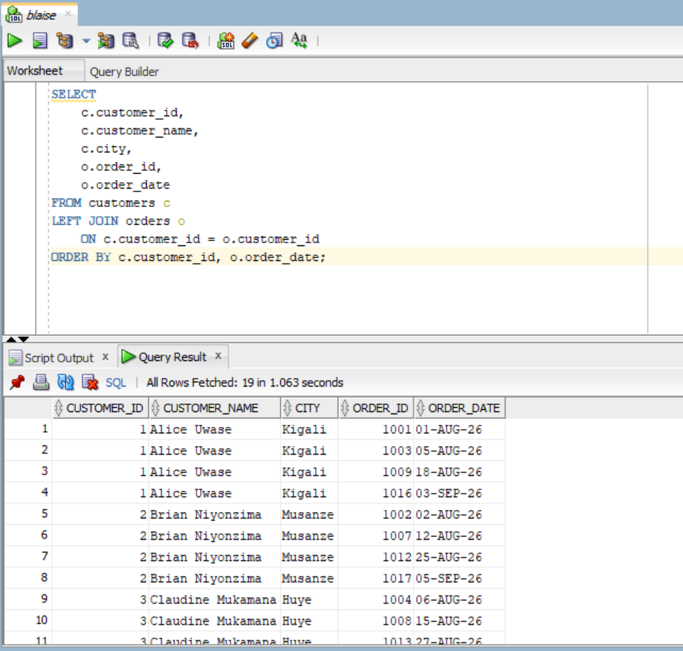
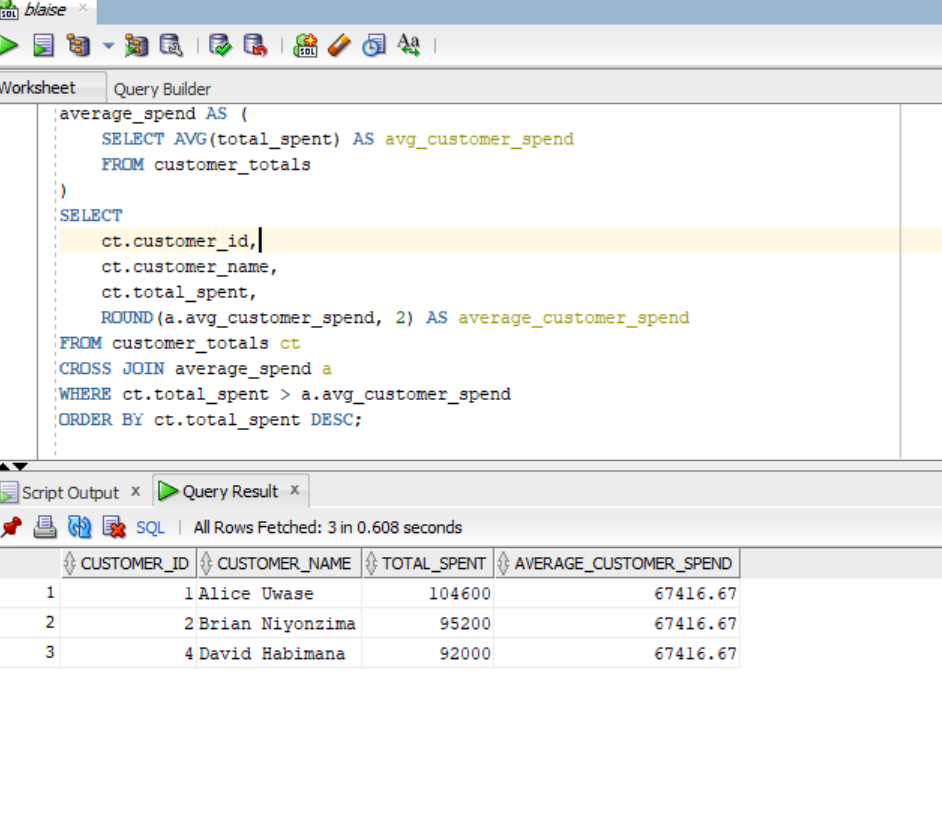
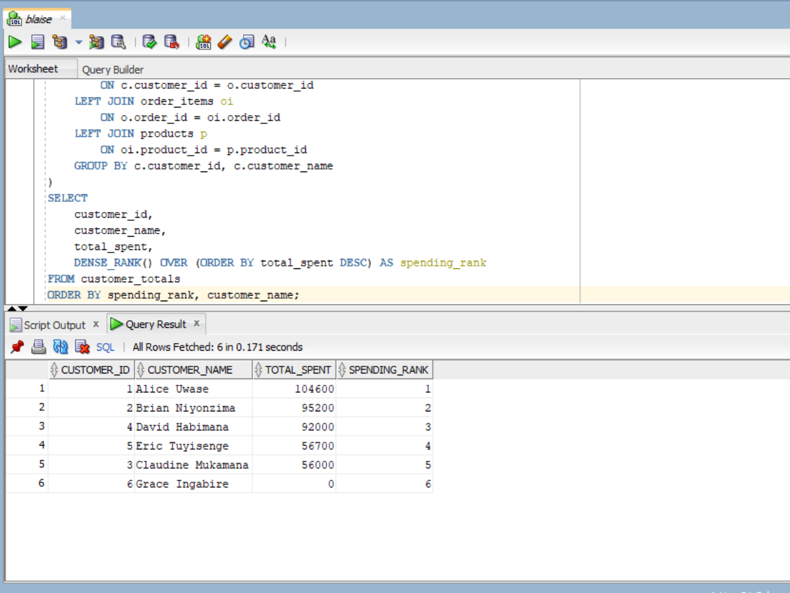
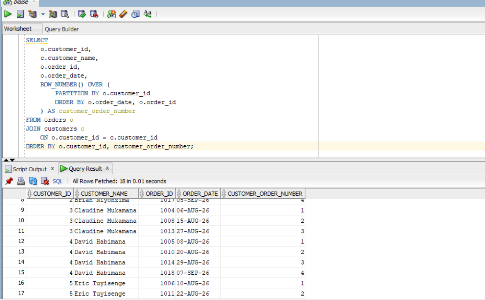
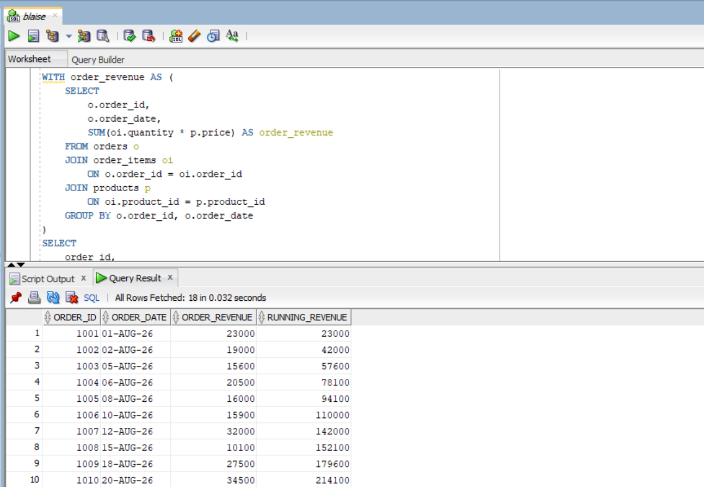
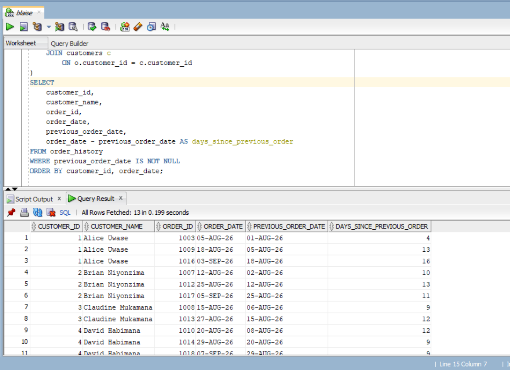

# Sunrise Supermarket - PL/SQL Assignment One

**Instructor:** Eric Maniraguha    
**Student Name:** Blaise Irakiza  
**Student ID:** 29289  
**Database:** Oracle Database  

---

## 1. Business Scenario

Sunrise Supermarket sells products to customers. Customers place orders, and each order contains one or more products. Management wants to understand customer activity, purchasing behavior, spending patterns, and sales trends over time.

This project implements the required database tables, realistic sample data, JOIN queries, a Common Table Expression (CTE), and SQL Window Functions.

---

## 2. Objectives

The objectives of this assignment are to:

1. Retrieve customer and order information using JOINs.
2. Retrieve product information for individual order items.
3. Include customers who have never placed an order.
4. Calculate customer spending and identify customers above average.
5. Rank customers according to total spending.
6. Number each customer's orders chronologically.
7. Calculate a running total of revenue over time.
8. Measure the number of days between consecutive orders for each customer.

---

## 3. Database Design

The project contains four related tables:

- **customers** - stores customer information.
- **products** - stores products, categories, and prices.
- **orders** - stores customer orders and order dates.
- **order_items** - stores the products and quantities contained in each order.

### Relationships

- `orders.customer_id` references `customers.customer_id`.
- `order_items.order_id` references `orders.order_id`.
- `order_items.product_id` references `products.product_id`.

The sample database contains:

- 6 customers
- 10 products
- 4 product categories
- 18 orders
- 36 order items

One customer intentionally has no order so that the LEFT JOIN requirement can be demonstrated.

---

## 4. Project Files

```text
sunrise_supermarket_assignment/
├── 01_create_tables.sql
├── 02_insert_data.sql
├── 03_queries.sql
├── README.md
└── screenshots/
```

---

## 5. How to Run the Project

### Step 1: Open Oracle SQL Developer

Connect to your Oracle database using your assigned database user.

### Step 2: Create the tables

Open:

```text
01_create_tables.sql
```

Run the entire script.

### Step 3: Insert the sample data

Open:

```text
02_insert_data.sql
```

Run the entire script.

### Step 4: Run the required queries

Open:

```text
03_queries.sql
```

Run each question separately and verify the results.

### Step 5: Capture evidence

For each question, take a screenshot showing the query and its result. Save the screenshots inside:

```text
screenshots/
```

---

# 6. Required Queries and Explanations

## Question 1 - Customer Orders

### Requirement

List every order with the customer's name, city, and order date.

### Technique

**INNER JOIN**

### Explanation

The `orders` table contains the order information, while the `customers` table contains customer details. The INNER JOIN connects the two tables using `customer_id`. Only orders with a matching customer are returned.

### SQL

```sql
SELECT
    o.order_id,
    c.customer_name,
    c.city,
    o.order_date
FROM orders o
INNER JOIN customers c
    ON o.customer_id = c.customer_id
ORDER BY o.order_date, o.order_id;
```

### Screenshot



---

## Question 2 - Order Items and Products

### Requirement

List every order item with the product name, category, price, and quantity ordered.

### Technique

**JOIN**

### Explanation

The `order_items` table contains the quantity and product ID. The `products` table contains the product name, category, and price. The JOIN connects the tables using `product_id`.

The query also calculates the line total:

`quantity × price`

### SQL

```sql
SELECT
    oi.order_item_id,
    oi.order_id,
    p.product_name,
    p.category,
    p.price,
    oi.quantity,
    oi.quantity * p.price AS line_total
FROM order_items oi
JOIN products p
    ON oi.product_id = p.product_id
ORDER BY oi.order_id, oi.order_item_id;
```

### Screenshot



---

## Question 3 - All Customers and Their Orders

### Requirement

List all customers and, where they exist, their orders, including customers who have never placed an order.

### Technique

**LEFT JOIN**

### Explanation

The `customers` table is the left table. Therefore, every customer is returned. If a customer has no matching order, the order columns contain `NULL`.

This is why LEFT JOIN is appropriate for this requirement.

### SQL

```sql
SELECT
    c.customer_id,
    c.customer_name,
    c.city,
    o.order_id,
    o.order_date
FROM customers c
LEFT JOIN orders o
    ON c.customer_id = o.customer_id
ORDER BY c.customer_id, o.order_date;
```

### Screenshot



---

## Question 4 - Customers Above Average Spending

### Requirement

Calculate each customer's total amount spent and return only customers who have spent above the average customer spend.

### Technique

**CTE (Common Table Expression)**

### Explanation

The first CTE, `customer_totals`, calculates the total spending for every customer.

The second CTE, `average_spend`, calculates the average of those customer totals.

The main query compares each customer's total with the average and returns only customers whose spending is greater than the average.

`NVL()` changes a NULL total into zero for customers who have no orders.

### SQL

```sql
WITH customer_totals AS (
    SELECT
        c.customer_id,
        c.customer_name,
        NVL(SUM(oi.quantity * p.price), 0) AS total_spent
    FROM customers c
    LEFT JOIN orders o
        ON c.customer_id = o.customer_id
    LEFT JOIN order_items oi
        ON o.order_id = oi.order_id
    LEFT JOIN products p
        ON oi.product_id = p.product_id
    GROUP BY c.customer_id, c.customer_name
),
average_spend AS (
    SELECT AVG(total_spent) AS avg_customer_spend
    FROM customer_totals
)
SELECT
    ct.customer_id,
    ct.customer_name,
    ct.total_spent,
    ROUND(a.avg_customer_spend, 2) AS average_customer_spend
FROM customer_totals ct
CROSS JOIN average_spend a
WHERE ct.total_spent > a.avg_customer_spend
ORDER BY ct.total_spent DESC;
```

### Screenshot



---

## Question 5 - Rank Customers by Spending

### Requirement

Rank customers by total amount spent, with the highest spender first.

### Technique

**Window Function - DENSE_RANK()**

### Explanation

The query first calculates each customer's total spending. `DENSE_RANK()` then assigns a ranking based on total spending in descending order.

The customer with the highest spending receives rank 1.

### SQL

```sql
WITH customer_totals AS (
    SELECT
        c.customer_id,
        c.customer_name,
        NVL(SUM(oi.quantity * p.price), 0) AS total_spent
    FROM customers c
    LEFT JOIN orders o
        ON c.customer_id = o.customer_id
    LEFT JOIN order_items oi
        ON o.order_id = oi.order_id
    LEFT JOIN products p
        ON oi.product_id = p.product_id
    GROUP BY c.customer_id, c.customer_name
)
SELECT
    customer_id,
    customer_name,
    total_spent,
    DENSE_RANK() OVER (ORDER BY total_spent DESC) AS spending_rank
FROM customer_totals
ORDER BY spending_rank, customer_name;
```

### Screenshot



---

## Question 6 - Number Each Customer's Orders

### Requirement

Number each customer's orders in the order they were placed.

### Technique

**Window Function - ROW_NUMBER()**

### Explanation

`ROW_NUMBER()` creates a sequence for each customer separately.

`PARTITION BY customer_id` starts the numbering again for every customer, while `ORDER BY order_date` ensures that the oldest order receives the smallest number.

### SQL

```sql
SELECT
    o.customer_id,
    c.customer_name,
    o.order_id,
    o.order_date,
    ROW_NUMBER() OVER (
        PARTITION BY o.customer_id
        ORDER BY o.order_date, o.order_id
    ) AS customer_order_number
FROM orders o
JOIN customers c
    ON o.customer_id = c.customer_id
ORDER BY o.customer_id, customer_order_number;
```

### Screenshot



---

## Question 7 - Running Revenue Total

### Requirement

Show a running total of revenue over time, ordered by order date.

### Technique

**Window Function - SUM() OVER()**

### Explanation

First, revenue is calculated for each order by multiplying quantity by product price.

The windowed `SUM()` then adds each order's revenue to all previous revenue, creating a cumulative running total.

### SQL

```sql
WITH order_revenue AS (
    SELECT
        o.order_id,
        o.order_date,
        SUM(oi.quantity * p.price) AS order_revenue
    FROM orders o
    JOIN order_items oi
        ON o.order_id = oi.order_id
    JOIN products p
        ON oi.product_id = p.product_id
    GROUP BY o.order_id, o.order_date
)
SELECT
    order_id,
    order_date,
    order_revenue,
    SUM(order_revenue) OVER (
        ORDER BY order_date, order_id
        ROWS BETWEEN UNBOUNDED PRECEDING AND CURRENT ROW
    ) AS running_revenue
FROM order_revenue
ORDER BY order_date, order_id;
```

### Screenshot



---

## Question 8 - Days Between Customer Orders

### Requirement

For customers with more than one order, show the number of days between their current and previous order.

### Technique

**Window Function - LAG()**

### Explanation

`LAG()` retrieves the previous order date for the same customer.

The current order date is then subtracted from the previous order date to determine the number of days between orders.

The first order for each customer has no previous order, so it is excluded using:

```sql
WHERE previous_order_date IS NOT NULL
```

### SQL

```sql
WITH order_history AS (
    SELECT
        o.customer_id,
        c.customer_name,
        o.order_id,
        o.order_date,
        LAG(o.order_date) OVER (
            PARTITION BY o.customer_id
            ORDER BY o.order_date, o.order_id
        ) AS previous_order_date
    FROM orders o
    JOIN customers c
        ON o.customer_id = c.customer_id
)
SELECT
    customer_id,
    customer_name,
    order_id,
    order_date,
    previous_order_date,
    order_date - previous_order_date AS days_since_previous_order
FROM order_history
WHERE previous_order_date IS NOT NULL
ORDER BY customer_id, order_date;
```

### Screenshot



---

# 7. Business Interpretation

The queries provide management with several useful insights.

### Customer activity

The LEFT JOIN analysis identifies customers who have not yet placed an order. Management can use this information to design targeted promotions and encourage inactive customers to make their first purchase.

### Customer value

The customer spending analysis identifies customers whose spending is above the average. These customers can be considered high-value customers and may be suitable for loyalty programs, personalized offers, or other retention strategies.

### Customer ranking

The spending ranking allows management to quickly identify the highest-value customers and understand how customers compare based on their total purchases.

### Order frequency

The order-numbering query shows the sequence of purchases for each customer. This can help management understand repeat-purchase behavior.

### Revenue trend

The running revenue query provides a cumulative view of sales over time. Management can use it to monitor how revenue is building throughout the period.

### Customer purchase intervals

The `LAG()` analysis shows the number of days between consecutive orders. Management can use this information to identify customers who purchase frequently and customers whose purchasing activity is slowing down.

---

# 8. Challenges Encountered and Solutions

### Challenge 1: Joining multiple tables

It can be difficult to understand which columns should be used to connect tables.

**Solution:** The foreign-key relationships were used:

- `customers.customer_id = orders.customer_id`
- `orders.order_id = order_items.order_id`
- `products.product_id = order_items.product_id`

### Challenge 2: Customers without orders

An INNER JOIN would remove customers who have no orders.

**Solution:** A LEFT JOIN was used with `customers` as the left table.

### Challenge 3: Calculating average customer spending

The average must be calculated after determining each customer's total.

**Solution:** A CTE was used to calculate customer totals first, followed by a second CTE for the average.

### Challenge 4: Comparing current and previous orders

A normal GROUP BY does not directly provide the previous order for each customer.

**Solution:** The `LAG()` window function was used.

---

# 9. Conclusion

This assignment demonstrates practical SQL techniques for analyzing supermarket sales data. JOINs were used to combine related tables, a CTE was used to organize multi-step spending analysis, and Window Functions were used for ranking, order numbering, running revenue, and comparing consecutive customer orders.

The resulting queries provide management with useful information about customer behavior, spending, order frequency, and revenue trends.


